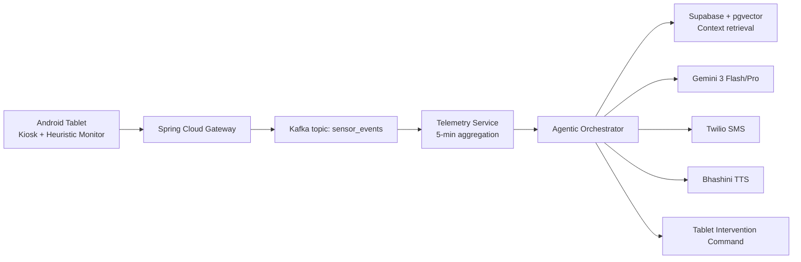

# Memoria: The Agentic Alzheimer's Companion

Memoria is a privacy-first, zero-hardware digital companion that transforms low-cost Android tablets into passive clinical assistants for Alzheimer's and dementia care. It detects behavioral and motor anomalies using on-device digital biomarkers, reasons over patient context using multimodal AI, and autonomously delivers de-escalation therapies before caregiver escalation.

## 1) Product Vision

### What Memoria solves
- Alzheimer's and dementia patients often reject wearables due to sensory discomfort.
- Camera-heavy surveillance raises privacy concerns and adoption barriers.
- Caregivers face high burnout from 24/7 vigilance requirements.

### Core experience
- Patient uses a simple kiosk-mode tablet for daily activities (news, photos, light games).
- Device passively captures non-intrusive digital biomarkers.
- Backend AI identifies emerging anxiety, confusion loops, or panic patterns.
- System launches personalized, culturally relevant interventions or escalates to caregivers.

### Outcome
- Supports aging in place.
- Reduces avoidable assisted-living and emergency burden.
- Improves caregiver confidence without continuous manual monitoring.

## 2) Target Users

- Elderly Alzheimer's/dementia patients (primary end-users)
- Family caregivers and designated guardians
- Government health agencies and public health programs

## 3) Scale Assumptions

- 1,000,000 registered patients
- 10,000,000 telemetry events per hour
- 50,000 concurrent active tablets with edge inference
- 500,000 daily generative AI invocations

## 4) Functional Requirements

- Digital biomarker extraction from accelerometer and touch latency
- Multimodal clinical grading:
	- Clock Drawing Test scoring with Gemini Vision
	- Vocabulary shrinkage / speech changes with Gemini Audio
- Agentic generative therapy:
	- Dynamic cognitive stimulation games via Android Canvas
	- Mood-adaptive intervention payloads
- RAG-based longitudinal memory with vector retrieval
- Emergency orchestration via Twilio (SMS) and Bhashini (regional TTS)

## 5) Non-Functional Requirements

- Scalability: 1M devices with continuous asynchronous ingestion
- Latency:
	- Sensor ingestion target: < 50 ms (asynchronous acknowledgement)
	- Intervention decision target: < 2.5 s
- Availability: 99.99% for core telemetry and intervention control plane
- Offline fallback behavior for low-connectivity/rural contexts
- Security and compliance: DPDP + HIPAA-aligned controls
- Data protection: AES-256 at rest, secure in-transit encryption, minimized retention

## 6) High-Level Architecture

### Core layers
- Client: Native Android Java app in strict kiosk mode
- Gateway: Spring Cloud Gateway (auth, routing, throttling)
- Services (Spring Boot microservices):
	- Telemetry Service
	- Agentic Orchestrator
	- Patient Identity Service
- Event bus: Apache Kafka
- Storage:
	- Supabase PostgreSQL (relational)
	- pgvector (RAG memory embeddings)
	- Redis (hot state cache)
- Observability: Prometheus, Grafana, ELK, Micrometer traces

### Request flow



## 7) AI and Agentic Architecture

### Model strategy
- Gemini 3 Flash: low-cost, fast triage/routing
- Gemini 3 Pro: deep multimodal clinical reasoning and intervention generation

### Reasoning pipeline
1. Observation: ingest and normalize recent telemetry narrative
2. Context retrieval: top-k similar behavioral days from pgvector
3. Inference: structured diagnosis JSON and action payload
4. Guardrails: medication/prohibited-content filter before delivery
5. Execution: tablet therapy, caregiver escalation, or both

### Multi-agent roles
- Monitor Agent (Edge heuristic): only triggers cloud when thresholds breach
- Diagnostic Agent (Gemini Core): predicts condition/anomaly state
- Therapy Agent (Gemini Creator): crafts personalized game/music intervention
- Execution Agent (Backend): executes Twilio/Bhashini/device commands

### Structured output contract

```json
{
	"anomaly_score": 8,
	"condition": "sundowning_anxiety",
	"action": "trigger_music_therapy",
	"urgency": "medium",
	"caregiver_notify": true
}
```

## 8) API Surface (v1)

### Telemetry ingestion
- `POST /api/v1/telemetry/ingest`
- Purpose: high-throughput async sensor and app-state events

### Clinical vision eval
- `POST /api/v1/clinical/vision-eval`
- Purpose: Clock Drawing Test and similar image-based grading

### Therapy generation
- `GET /api/v1/therapy/generate`
- Purpose: synchronous therapeutic game payload generation

### Example ingest payload

```json
{
	"patientId": "p_123",
	"timestamp": "2026-03-13T18:10:00Z",
	"events": [
		{"metricType": "accel_variance_10s", "value": 4.9},
		{"metricType": "app_switch_rate_1m", "value": 14},
		{"metricType": "touch_latency_ms", "value": 460}
	]
}
```

## 9) Data Model

### Relational schema (Supabase PostgreSQL)
- `users(id, demographic, region, caregiver_id)`
- `caregivers(id, phone_number, preferences)`
- `telemetry_logs(id, user_id, timestamp, metric_type, value)`

### Vector memory (pgvector)
- `daily_evaluations(id, user_id, date, summary_text, embedding_vector)`
- Retrieval index: IVFFlat or HNSW (based on benchmark profile)

## 10) Data Pipeline

1. Android SensorManager captures X/Y/Z and interaction events
2. Edge feature engineering computes variance and heuristic thresholds
3. Gateway accepts and routes to Kafka
4. Telemetry consumers aggregate into 5-minute narratives
5. Orchestrator enriches with pgvector context
6. Gemini returns structured decision
7. Execution engine triggers intervention/escalation

## 11) Security and Compliance

- Authentication:
	- Caregiver portal: OAuth2/OIDC
	- Tablet identity: device certificates + mTLS
- Authorization: Spring Security RBAC with strict patient-caregiver boundary
- Encryption:
	- At rest: AES-256
	- In transit: TLS 1.2+ and service-level mTLS where applicable
- Data minimization:
	- No permanent storage of raw camera/audio feeds
	- Process in-memory and discard post-analysis
- Prompt-injection defense:
	- Input sanitization and policy layer before model invocation
	- Output classifier/filter to block unsafe or non-therapeutic instructions

## 12) Scalability and Performance Design

- Edge gating to suppress non-anomalous cloud traffic
- Kafka partitioning by `user_id` to preserve per-user chronology
- Batch model invocation (5-minute windows) to reduce token burn
- Redis caching for interests/profile hot reads
- Internal gRPC for service-to-service low-overhead calls
- HPA autoscaling on CPU + Kafka lag signals

## 13) Reliability and Failure Handling

- Circuit breaker around Gemini and third-party APIs (Resilience4j)
- Offline intervention fallback from local SQLite content pack
- Dead Letter Queue for unprocessable Kafka events
- Retry policies with jittered backoff for network integrations
- Graceful degradation: local heuristics stay active if cloud unreachable

## 14) Monitoring and Evaluation

### Platform SLOs
- API gateway p99 latency < 200 ms
- Core telemetry uptime >= 99.99%

### AI/clinical quality metrics
- False Positive Rate (caregiver alerts) < 1%
- Retrieval relevance for similar-day context
- Tremor reduction 5 min post-intervention
- Time-to-calm and intervention success rate

### Observability stack
- Prometheus + Grafana dashboards
- Centralized logs via ELK
- Tracing with Micrometer/Zipkin end-to-end IDs

## 15) Cost Optimization

- Heuristic gating: invoke paid models only on threshold breaches
- Payload compaction/token-aware telemetry shorthand
- Model routing:
	- Flash for basic routing
	- Pro for complex multimodal grading

## 16) Development Roadmap

### Phase 1 (MVP)
- Android kiosk shell
- Edge tremor heuristics
- Basic Spring Boot CRUD and ingest pipeline

### Phase 2 (AI Integration)
- Gemini integration (Flash + Pro)
- pgvector retrieval memory
- Dynamic therapy payload generation

### Phase 3 (Enterprise)
- Twilio + Bhashini orchestration
- DPDP security audit controls
- Advanced caregiver workflows

### Phase 4 (National Rollout)
- 1M user load testing
- GKE autoscaling hardening
- Public healthcare deployment models

## 17) Known Technical Risks and Mitigations

- Battery drain from high-frequency sensing:
	- Adaptive sampling and event batching
- Hallucinated medical advice:
	- Policy-constrained prompts + output blocking layer
- Rural connectivity interruptions:
	- Offline-first fallback interventions
- Alert fatigue for caregivers:
	- Confidence thresholds and deduplication windows

## 18) Suggested Repository Structure

```text
android-kiosk/
gateway-service/
telemetry-service/
orchestrator-service/
identity-service/
shared-contracts/
infra/
	k8s/
	monitoring/
	terraform/
docs/
	architecture/
	api/
	security/
```

## 19) Implementation Notes

- Keep prompts as versioned code artifacts under source control.
- Add automated schema validation for all LLM JSON outputs.
- Build replayable evaluation datasets from anonymized historical logs.
- Add synthetic load tests for Kafka lag and intervention latency.

## 20) Mission Statement

Memoria aims to provide dignified, privacy-aware, culturally adaptive dementia support at national scale by combining edge intelligence, multimodal foundation models, and resilient healthcare-grade backend systems.

## 21) Monorepo Implementation (Current)

This repository now includes a runnable starter implementation for the backend and infrastructure:

- `gateway-service`: Spring Cloud Gateway routing for API edge traffic
- `telemetry-service`: async telemetry ingestion and Kafka publish path
- `orchestrator-service`: diagnosis, therapy generation, and vision-eval starter endpoints
- `identity-service`: patient/caregiver profile APIs (starter in-memory store)
- `shared-contracts`: OpenAPI and JSON schema contracts
- `infra`: Kubernetes base manifests and Prometheus scrape config
- `scripts`: local bootstrap and run scripts

## 22) Local Quick Start

### Prerequisites
- Java 17+
- Maven 3.9+
- Docker and Docker Compose

### 1. Start infrastructure

```bash
make infra-up
```

### 2. Build all services

```bash
make build
```

### 3. Run services (separate terminals)

```bash
make run-telemetry
make run-orchestrator
make run-identity
make run-gateway
```

### 4. Smoke checks

```bash
curl http://localhost:8080/api/v1/status
curl http://localhost:8081/api/v1/status
curl http://localhost:8082/api/v1/status
curl http://localhost:8083/api/v1/status
```

### 4.1 Local JWT issuer (Keycloak)

- Keycloak is exposed at `http://localhost:8084`
- Realm: `memoria`
- Seed users:
	- `admin` / `admin` (realm role: `admin`)
	- `caregiver` / `caregiver` (realm role: `caregiver`)

Identity service validates JWTs using:

```bash
JWT_ISSUER_URI=http://localhost:8084/realms/memoria
```

### 5. Example telemetry ingest

```bash
curl -X POST http://localhost:8080/api/v1/telemetry/ingest \
	-H "Content-Type: application/json" \
	-d '{
		"patientId":"p_123",
		"timestamp":"2026-03-13T18:10:00Z",
		"events":[
			{"metricType":"accel_variance_10s","value":4.9},
			{"metricType":"app_switch_rate_1m","value":14}
		]
	}'
```

## 23) Deployment Starter

Apply Kubernetes base resources:

```bash
kubectl apply -k infra/k8s/base
```

This creates the `memoria` namespace, deploys all four services, and configures initial HPA for telemetry ingestion.

## 24) Newly Implemented Backend Capabilities

- Identity service now uses PostgreSQL + Flyway migrations instead of in-memory maps.
- JWT resource server and role-based method authorization (`ADMIN`, `CAREGIVER`) are enabled.
- Telemetry service now consumes Kafka events and flushes 5-minute summaries into Postgres.
- Daily memory rows are written to a `daily_evaluations` pgvector table.
- Orchestrator can retrieve top similar historical summaries from pgvector.
- Orchestrator now has resilient provider clients for:
	- Gemini
	- Twilio
	- Bhashini
- New endpoint: `POST /api/v1/orchestrator/intervene` for one-shot diagnosis + therapy + escalation execution.

## 25) Newly Implemented Android Kiosk Starter

- Added an Android application module under `android-kiosk/app`.
- Kiosk activity attempts lock task mode for launcher-style usage.
- Sensor manager tracks accelerometer magnitudes and computes rolling variance summary.
- SQLite offline therapy pack is preloaded and queried locally for fallback interventions.

## 26) Database Migrations Added

- `identity-service/src/main/resources/db/migration/V1__init_identity_schema.sql`
- `telemetry-service/src/main/resources/db/migration/V1__init_telemetry_schema.sql`

## 27) Test Status

- Integration smoke test classes are included per service.
- In this environment they are marked `@Disabled` because they require running external infrastructure (Kafka/Postgres/JWT issuer/provider endpoints) and deterministic CI fixtures.
- Testcontainers-based integration tests are now included for:
	- Telemetry aggregation persistence
	- Orchestrator pgvector retrieval
	- Identity JPA persistence with Flyway migrations

## 28) CI Pipeline

GitHub Actions workflow is provided at:

- `.github/workflows/ci.yml`

It runs on pushes and pull requests to `main`, and executes:

- Notification helper dry-run smoke check (`scripts/send-webhook-notification.sh`)
- `mvn -B clean test`
- Surefire report artifact upload on every run

## 29) Auth and Smoke Scripts

### Get token

```bash
./scripts/get-keycloak-token.sh admin admin
./scripts/get-keycloak-token.sh caregiver caregiver
```

### End-to-end authenticated smoke test

```bash
./scripts/smoke-auth.sh
```

This script performs:

- Admin-authenticated caregiver creation
- Admin-authenticated patient creation
- Caregiver-authenticated patient read
- Orchestrator intervention invocation

## 30) Strict AI Output Validation

The orchestrator now enforces JSON Schema validation of diagnosis output before mapping model responses.

- Schema file: `orchestrator-service/src/main/resources/schemas/diagnosis-output.schema.json`
- Parser with schema checks: `orchestrator-service/src/main/java/com/memoria/orchestrator/service/GeminiDiagnosisParserService.java`

If schema validation fails, the system falls back to heuristic diagnosis and then passes through safety sanitization.

## 31) Container Images and Release Automation

### Dockerfiles

Each backend service now includes a multi-stage Dockerfile:

- `gateway-service/Dockerfile`
- `telemetry-service/Dockerfile`
- `orchestrator-service/Dockerfile`
- `identity-service/Dockerfile`

### Local image build

```bash
./scripts/build-images.sh
```

You can override defaults:

```bash
OWNER=my-org TAG=v0.1.0 ./scripts/build-images.sh
```

### Release workflow

- Workflow: `.github/workflows/release-images.yml`
- Trigger: git tags matching `v*` or manual dispatch
- Registry: GHCR (`ghcr.io/<owner>/memoria-<service>`)
- Supply chain hardening:
	- Keyless signing with Sigstore Cosign (OIDC)
	- Build provenance attestation pushed with GitHub Attestations
	- SPDX JSON SBOM generated per service image
	- Keyless SBOM attestation attached to image digest
	- Trivy vulnerability scan (HIGH/CRITICAL, ignore unfixed) with SARIF upload

Verify signatures and attestations for a released digest:

```bash
cosign verify \
	--certificate-oidc-issuer=https://token.actions.githubusercontent.com \
	--certificate-identity-regexp='https://github.com/.+/.+/\.github/workflows/release-images\.yml@.+' \
	ghcr.io/<owner>/memoria-gateway-service@sha256:<digest>
```

```bash
gh attestation verify \
	oci://ghcr.io/<owner>/memoria-gateway-service@sha256:<digest> \
	--owner <owner>
```

```bash
cosign verify-attestation --type spdxjson \
	--certificate-oidc-issuer=https://token.actions.githubusercontent.com \
	--certificate-identity-regexp='https://github.com/.+/.+/\.github/workflows/release-images\.yml@.+' \
	ghcr.io/<owner>/memoria-gateway-service@sha256:<digest>
```

Local vulnerability scan for a released digest:

```bash
OWNER=<owner> SERVICE=gateway-service DIGEST=sha256:<digest> ./scripts/scan-image-vulnerabilities.sh
```

## 32) Postman Assets

Import these files into Postman:

- `docs/api/Memoria.postman_collection.json`
- `docs/api/Memoria.postman_environment.json`

Included flow:

- Keycloak token retrieval for admin/caregiver
- Authenticated identity API creation and retrieval
- Telemetry ingest
- Orchestrator intervention invocation

## 33) mTLS and Network Hardening Templates

Production security templates are available under:

- `infra/security/mtls/README.md`
- `infra/security/mtls/networkpolicy-default-deny.yaml`
- `infra/security/mtls/networkpolicy-allow-gateway.yaml`
- `infra/security/mtls/istio-peer-authentication-strict.yaml`
- `infra/security/mtls/istio-destination-rule-mtls.yaml`

These provide a zero-trust baseline with strict service-to-service encryption (Istio) and least-privilege ingress controls.

## 34) Helm Deployment Packaging

A reusable Helm chart is available at:

- `charts/memoria/Chart.yaml`
- `charts/memoria/values.yaml`
- `charts/memoria/values-dev.yaml`
- `charts/memoria/values-prod.yaml`

Capabilities included in chart templates:

- Deployments and Services for gateway, telemetry, orchestrator, identity
- Optional telemetry HPA
- Optional gateway Ingress with TLS settings

Install with:

```bash
helm upgrade --install memoria ./charts/memoria \
	--namespace memoria \
	--create-namespace
```

Use environment-specific overrides:

```bash
helm upgrade --install memoria ./charts/memoria \
	--namespace memoria \
	--create-namespace \
	-f ./charts/memoria/values-prod.yaml
```

## 35) Performance Testing (k6)

Baseline load-test scripts are available under:

- `perf/k6/telemetry-ingest.js`
- `perf/k6/orchestrator-analyze.js`
- `scripts/run-k6.sh`

Run locally:

```bash
BASE_URL=http://localhost:8080 DURATION=2m VUS_TELEMETRY=20 VUS_ANALYZE=10 ./scripts/run-k6.sh
```

## 36) Load Test GitHub Workflow

Manual load tests can be run in CI via:

- `.github/workflows/load-test.yml`

Workflow inputs:

- `base_url`
- `duration`
- `telemetry_vus`
- `analyze_vus`

## 37) Release Artifact Verification Workflow

To validate a published image digest (signature + provenance + SBOM attestation), use:

- `.github/workflows/verify-release-artifacts.yml`
- `scripts/verify-release-artifacts.sh`
- `scripts/scan-image-vulnerabilities.sh`

Workflow inputs:

- `service` (one of gateway/telemetry/orchestrator/identity service images)
- `digest` (`sha256:<64-hex>`)
- optional `owner` (defaults to current repository owner)

Local usage:

```bash
OWNER=<owner> SERVICE=gateway-service DIGEST=sha256:<digest> ./scripts/verify-release-artifacts.sh
```

## 38) Automatic Verification After Release

An automatic post-release verification workflow now runs after successful `Release Images` completion:

- `.github/workflows/verify-after-release.yml`

Behavior:

- Consumes per-service digest artifacts emitted by `Release Images`
- Verifies image signature, build provenance, and SBOM attestation for each service image
- Executes for all four services in parallel matrix jobs

## 39) Weekly Vulnerability Drift Scan

To catch newly disclosed CVEs without waiting for a new release, a scheduled workflow scans the latest published images:

- `.github/workflows/weekly-vulnerability-scan.yml`

Schedule:

- Every Monday at 03:00 UTC
- Also supports manual dispatch

Policy and output:

- Scans `ghcr.io/<owner>/memoria-<service>:latest` for all four services
- Blocks on HIGH/CRITICAL vulnerabilities (ignoring unfixed findings)
- Uploads SARIF into GitHub security scanning and retains SARIF artifacts

## 40) Security Failure Notifications

Security workflows can emit Slack alerts on failure when a webhook secret is configured.

Applies to:

- `.github/workflows/verify-after-release.yml`
- `.github/workflows/weekly-vulnerability-scan.yml`
- `scripts/send-webhook-notification.sh`

Optional repository secrets:

- `SLACK_WEBHOOK_URL` (Slack incoming webhook URL)
- `TEAMS_WEBHOOK_URL` (Microsoft Teams incoming webhook URL)

Behavior:

- Sends one alert when the workflow verification/scan job fails to each configured channel
- Includes run metadata for triage: repository, branch, workflow name, run attempt, actor, and direct run link
- If a channel secret is not set, that channel's notification job is skipped
- Notification jobs only run on the first workflow attempt (`github.run_attempt == 1`) to avoid duplicate alerts on reruns
- Webhook payload JSON is constructed through a shared helper script with safe escaping

Dry-run payload validation (no webhook call):

```bash
DRY_RUN=1 MESSAGE=$'sample alert\nrepo: owner/repo' ./scripts/send-webhook-notification.sh
```